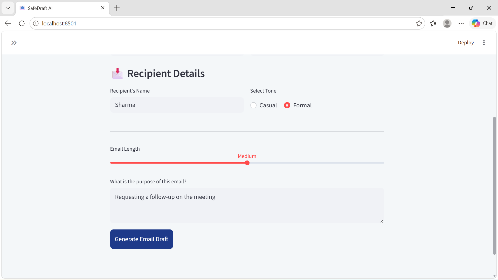
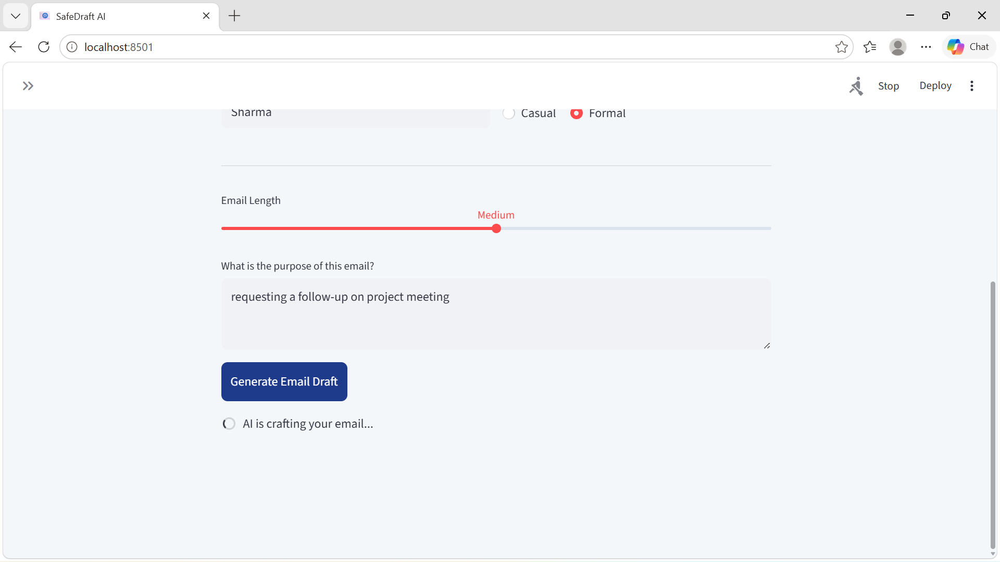
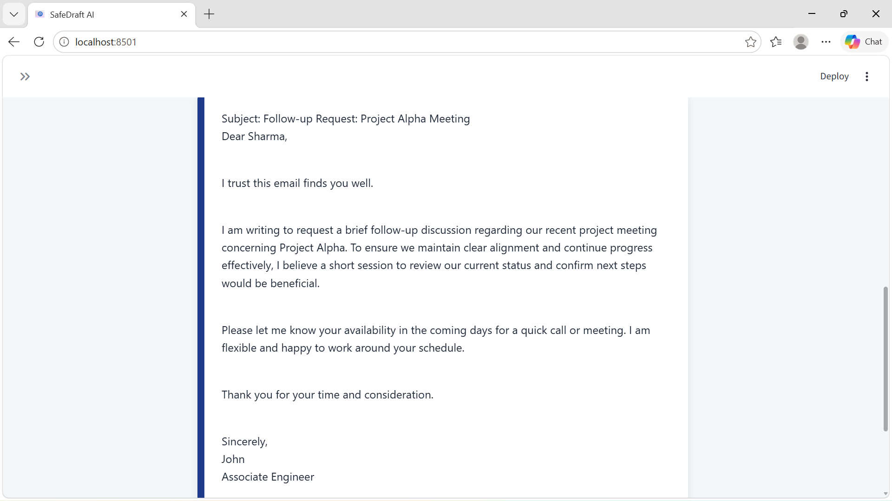

# ai-email-generator-SafeDraft

SafeDraft is a secure, corporate-grade email automation tool built with Python and Streamlit. It leverages Google’s Gemma 3 and Gemini 2.0 Flash models to generate high-quality, professional communication while maintaining strict safety guardrails, few shot prompting and multi-layer defense against prompt injection and malicious inputs.

## Features

*AI-powered email generation using Google's Gemma 3 model
*Prompt injection prevention
*Input validation for secure user interactions
*Few-shot prompting for improved response quality
*AI safety filtering using Google Cloud safety thresholds
*Robust error handling for API failures and invalid inputs
*User-friendly Streamlit interface

## Technologies Used
*Language: Python 
*Frontend: Streamlit
*LLM Engines: Google Gemini 2.0 Flash / Gemma 3
*API Management: Google GenAI SDK
*Security: Custom Keyword-based Input Validation & Google Safety Thresholds

## Future Enhancements
Email tone customization
Multi-language support
Email template library
User authentication and history tracking

## Screenshots

user input 1

user input 2

Generated Email Output

## Author

Sivanika Sri
